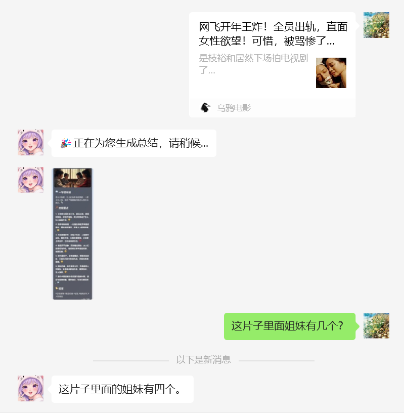
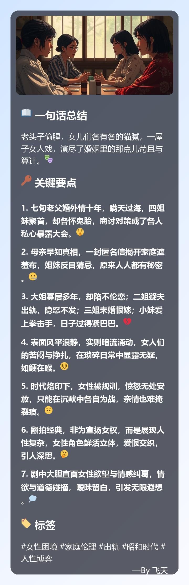

# JinaSum
Dify on WeChat项目插件, 使用newspaper3k和ChatGPT总结网页链接内容

> 注: 由于微信政策调整,jina reader已无法获取微信公众号文章内容。本插件已更新为本地直接提取文章内容,但出于历史原因仍保留JinaSum的名称。但仍不保证腾讯风控升级导致无法获取文章内容的可能性

支持总结公众号、小红书、csdn等分享卡片链接。

## 功能
- 支持自动总结微信文章
- 支持手动触发总结
- 支持总结后追问文章内容
- 支持群聊和私聊场景
- 支持黑名单群组配置
- 智能过滤视频、音乐、地图等不适合总结的内容

## 使用方法
1. 私聊：
   - 直接发送文章链接或分享卡片，会自动总结
   - 总结完成后5分钟内可发送"问xxx"追问文章内容

2. 群聊：
   - 当auto_sum=true时：
     - 非黑名单群组：自动总结分享卡片和链接
     - 黑名单群组：需要发送"总结"触发总结
   - 当auto_sum=false时：
     - 所有群组都需要发送"总结"触发总结
   - 分享卡片总结：
     - 发送卡片后，发送"总结"触发
   - URL总结方式灵活，支持：
     - "总结 链接"
     - "总结链接"
     - "链接总结"
   - 总结完成后5分钟内可发送"问xxx"追问文章内容




## 配置说明
```json
{
    "max_words": 8000,                                # 网页链接内容的最大字数，防止超过最大输入token
    "auto_sum": false,                                # 是否自动总结（仅群聊有效）
    "white_url_list": [],                             # url白名单, 列表为空时不做限制，黑名单优先级大于白名单
    "black_url_list": [                               # url黑名单，排除不支持总结的视频号等链接
        "https://support.weixin.qq.com",
        "https://channels-aladin.wxqcloud.qq.com",
        "https://www.wechat.com",
        "https://channels.weixin.qq.com",
        "https://docs.qq.com",
        "https://work.weixin.qq.com",
        "https://map.baidu.com",
        "https://map.qq.com",
        "https://y.qq.com",
        "https://music.163.com"
    ],
    "black_group_list": [],                           # 群聊黑名单，使用群名
    "prompt": "我需要对下面的文本进行总结，总结输出包括以下三个部分：\n📖 一句话总结\n🔑 关键要点,用数字序号列出3-5个文章的核心内容\n🏷 标签: #xx #xx\n请使用emoji让你的表达更生动。",  # 链接内容总结提示词
    "cache_timeout": 300                              # 群聊消息缓存超时时间（秒）
}
```

## 注意事项
1. 插件现已本地环境直接提取文章内容,不再依赖jina reader
2. 群聊中需要@机器人触发总结
3. 支持的文章来源：微信公众号、知乎、简书等主流平台
4. 黑名单群组配置使用群名，不是群ID
5. 私聊中始终自动总结，不受auto_sum配置影响
6. 群聊消息缓存时间默认为5分钟
7. 受微信风控机制影响，部分文章仍可能无法获取

## Star History

[](https://star-history.com/#sofs2005/jina_sum&Date)

## 打赏支持

如果您觉得这个插件对您有帮助，欢迎扫描下方二维码进行打赏支持，让我能够持续改进和开发更多实用功能。


